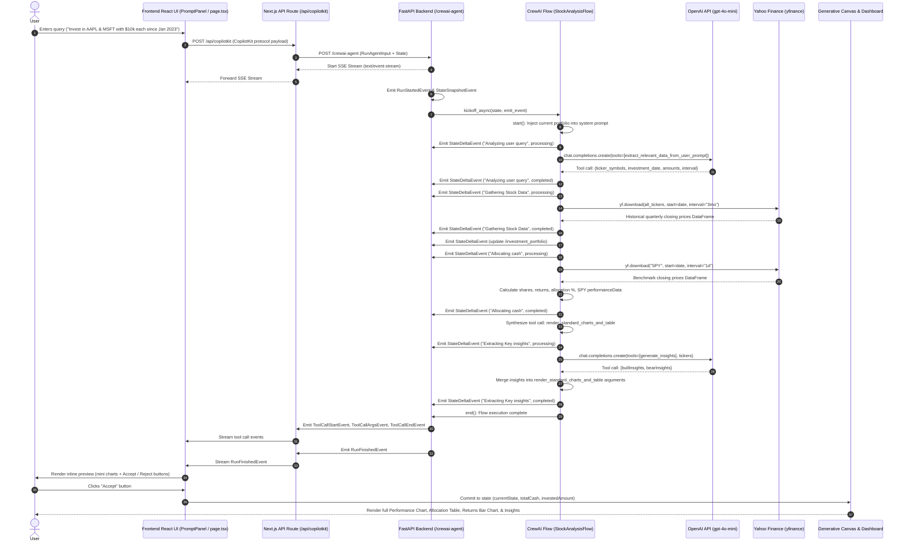

# End-to-End Data Flow Architecture

This document maps the complete data lifecycle of the **Stock Portfolio Analysis Agent**, from raw user input in the chat box to final dashboard rendering.

---

## 1. High-Level Data Flow Architecture

The application follows an asynchronous event-driven streaming pipeline connecting the React client, Next.js API route proxy, FastAPI backend, CrewAI flow orchestrator, OpenAI API, and Yahoo Finance market data engine.



---

## 2. Detailed Step-by-Step Lifecycle Analysis

### Step 1: User Action & Prompt Submission
- **Source**: [`PromptPanel`](file:///Users/apple/Documents/stock-portfolio-intelligence/ai-engineering-hub/stock-portfolio-analysis-agent/frontend/src/app/components/prompt-panel.tsx) via `CopilotChat`.
- **Action**: User types an investment query (e.g. *"Invest in Apple and Microsoft with $10k each since Jan 2023"*).
- **Data Payload**: Dispatched by CopilotKit client to Next.js API route `/api/copilotkit`.

### Step 2: Next.js API Route Proxying
- **Source**: [`frontend/src/app/api/copilotkit/route.ts`](file:///Users/apple/Documents/stock-portfolio-intelligence/ai-engineering-hub/stock-portfolio-analysis-agent/frontend/src/app/api/copilotkit/route.ts).
- **Function**: Uses `HttpAgent` and `CopilotRuntime` to bridge the React client with the FastAPI server.
- **Destination**: `POST http://0.0.0.0:8000/crewai-agent`.

### Step 3: FastAPI Ingestion & SSE Handshake
- **Source**: [`agent/main.py`](file:///Users/apple/Documents/stock-portfolio-intelligence/ai-engineering-hub/stock-portfolio-analysis-agent/agent/main.py).
- **Action**:
  1. Accepts `RunAgentInput` containing `messages`, `state`, and `tools`.
  2. Opens a persistent `StreamingResponse(event_generator(), media_type="text/event-stream")`.
  3. Sends `RunStartedEvent` and initial `StateSnapshotEvent` (with current cash and portfolio).
  4. Dispatches the background worker:
     ```python
     asyncio.create_task(
         StockAnalysisFlow().kickoff_async(inputs={
             "state": state,
             "emit_event": emit_event,
             "investment_portfolio": input_data.state["investment_portfolio"]
         })
     )
     ```

### Step 4: CrewAI Flow Execution Pipeline

#### 4.1 Stage: `start()`
- Reads `self.state["investment_portfolio"]`.
- Injects existing portfolio holdings as a JSON string into `{PORTFOLIO_DATA_PLACEHOLDER}` inside `system_prompt`.

#### 4.2 Stage: `chat()`
- Pushes `tool_log` event: `"Analyzing user query"` (`status="processing"`).
- Calls OpenAI API:
  - Model: `gpt-4o-mini`.
  - Tool definition: `extract_relevant_data_from_user_prompt`.
- Receives structured tool call response:
  ```json
  {
    "ticker_symbols": ["AAPL", "MSFT"],
    "investment_date": "2023-01-01",
    "amount_of_dollars_to_be_invested": [10000, 10000],
    "interval_of_investment": "single_shot",
    "to_be_added_in_portfolio": true
  }
  ```
- Updates `tool_log` event: `"Analyzing user query"` (`status="completed"`).
- Transitions to `simulation`.

#### 4.3 Stage: `simulation()`
- Pushes `tool_log` event: `"Gathering Stock Data"` (`status="processing"`).
- Merges current tickers with existing portfolio tickers to enforce additive holdings.
- Emits `StateDeltaEvent` updating `/investment_portfolio` in frontend state.
- Date normalization: Restricts start date to 4 years max (`current_year - 4-01-01`).
- Calls `yfinance.download(all_tickers, start=investment_date, interval="3mo")`.
- Stores `data["Close"]` DataFrame into `self.be_stock_data`.
- Updates `tool_log` event: `"Gathering Stock Data"` (`status="completed"`).
- Transitions to `allocation`.

#### 4.4 Stage: `allocation()`
- Pushes `tool_log` event: `"Allocating cash"` (`status="processing"`).
- Simulates asset purchases:
  - **Single-shot**: Buys integer shares `allocated // price` at $t_0$. Deducts cost from cash.
  - **DCA**: Attempts share purchases at each quarterly timestamp.
- Computes final metrics:
  - Total portfolio value, individual dollar returns, and percentage returns.
- Downloads `SPY` benchmark data via `yfinance.download("SPY", interval="1d")`.
  - Reindexes to match portfolio quarterly dates with forward-fill.
  - Simulates identical dollar amount invested in SPY.
- Assembles `performanceData` time-series array:
  ```json
  [
    { "date": "2023-01-01", "portfolio": 20000.0, "spy": 20000.0 },
    { "date": "2023-04-01", "portfolio": 22450.0, "spy": 21300.0 }
  ]
  ```
- Synthesizes `render_standard_charts_and_table` tool call message.
- Updates `tool_log` event: `"Allocating cash"` (`status="completed"`).
- Transitions to `insights`.

#### 4.5 Stage: `insights()`
- Pushes `tool_log` event: `"Extracting Key insights"` (`status="processing"`).
- Calls OpenAI API:
  - Prompt: `insights_prompt` + ticker symbols.
  - Tool definition: `generate_insights`.
- Receives structured thesis output:
  ```json
  {
    "bullInsights": [
      { "title": "Services Growth", "description": "High-margin ecosystem expansion.", "emoji": "📈" }
    ],
    "bearInsights": [
      { "title": "Regulatory Headwinds", "description": "Antitrust scrutiny in key markets.", "emoji": "⚠️" }
    ]
  }
  ```
- Merges `bullInsights` and `bearInsights` directly into `render_standard_charts_and_table` arguments.
- Updates `tool_log` event: `"Extracting Key insights"` (`status="completed"`).
- Transitions to `end()`.

---

## 3. Streaming & Event Relay (`agent/main.py`)

As the workflow runs, events placed on the internal `asyncio.Queue` are converted to SSE format:
1. `ToolCallStartEvent`: Notifies CopilotKit that a tool call has begun.
2. `ToolCallArgsEvent`: Delivers the complete JSON argument payload containing `investment_summary` and `insights`.
3. `ToolCallEndEvent`: Closes the tool call.
4. `RunFinishedEvent`: Marks the completion of the agent run.

---

## 4. Frontend Reception & Human-in-the-Loop Action

```mermaid
graph TD
    A[SSE Event Stream Received] --> B[CopilotKit Runtime Intercepts Tool Call]
    B --> C{Action Name?}
    C -->|render_standard_charts_and_table| D[useCopilotAction Hook Triggers]
    D --> E[Render In-Chat Micro-Preview]
    E --> F[LineChartComponent small]
    E --> G[BarChartComponent small]
    E --> H[AllocationTableComponent small]
    E --> I[Display Accept / Reject Buttons]
    I -->|User clicks Accept| J[Commit to React State]
    I -->|User clicks Reject| K[Discard Changes]
    J --> L[Update totalCash & investedAmount]
    J --> M[Update currentState]
    J --> N[GenerativeCanvas Renders Full Dashboard]
```



### State Commit upon User "Accept"
When the user clicks the green **"Accept"** button:
1. `setTotalCash(args.investment_summary.cash)`
2. `setInvestedAmount(...)`
3. `setCurrentState(...)`:
   - Commits `performanceData` (used by main Line Chart).
   - Commits `returnsData` (used by Returns Bar Chart).
   - Commits `allocations` (used by Allocation Table).
   - Commits `bullInsights` and `bearInsights` (used by Market Insights cards).
4. `setState(...)`: Updates CoAgent shared state with new `available_cash`.
5. `respond(...)`: Sends message back to CopilotKit runtime confirming acceptance without requesting additional tool calls.
6. The main **Generative Canvas** instantly reflects the updated portfolio.
